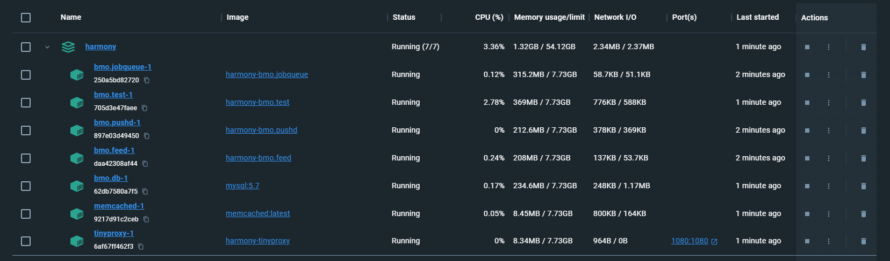
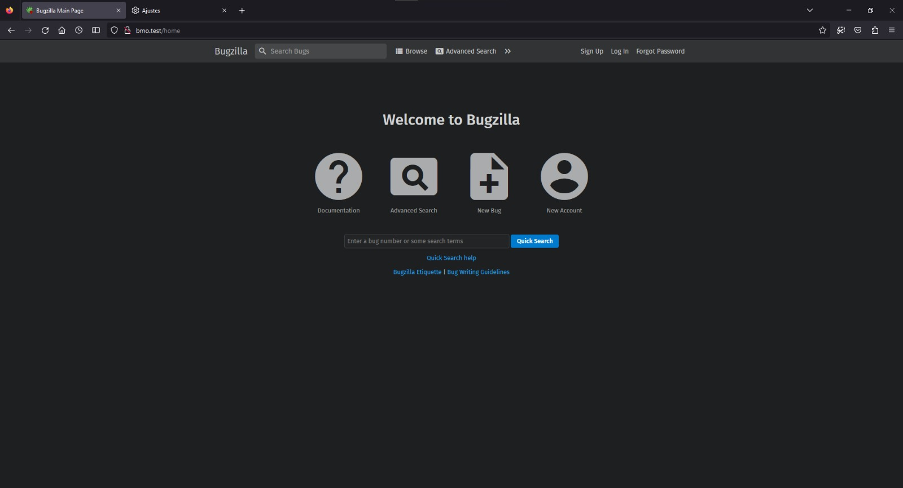
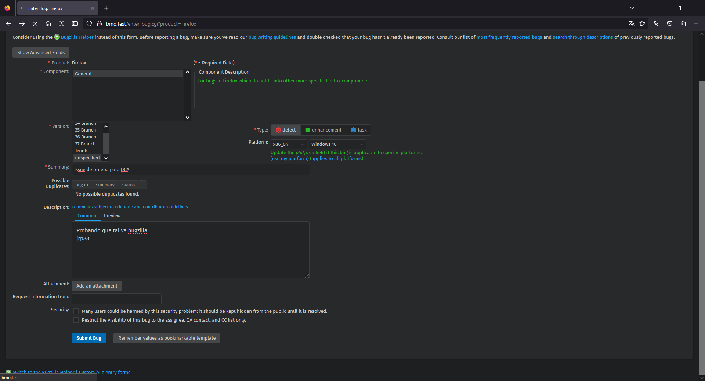
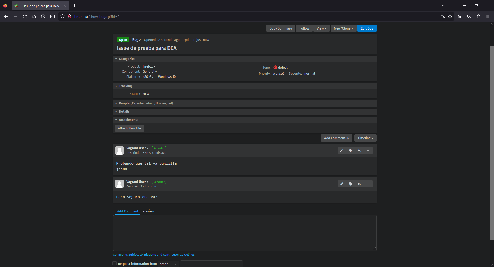

# Bugzilla
Para probar bugzilla haremos uso de un conjunto de imágenes de docker preparadas con un composer para ejecutar bugzilla.
Las insctrucciones se encuentran [aquí](https://github.com/bugzilla/harmony/blob/main/docker/development.md).

Como podemos ver, en conjunto, todos los contenedores no hacen uso de demasiados recursos, no llenago ni a un 4% de uso de CPU ni 2GB de memoria, siendo siete contenedores en ejecucuión a la vez,
sin embargo notamos que estos hacen mucho uso de la red incluso cuando no hay usuarios usando la prágina web en el momento de tomar la captura de pantalla.

Tambien notamos que la aplicación es algo lenta para cargar pero esto puede que se deba a uso de contenedores.

En cuanto al uso, después de configurar el proxy de firefox como se indica en las instrucciones, probamos un poco la app
y notamos que es muy simple de usar, aunque la cantidad de botones y opciones en ciertas páginas, como la de búsqueda avanzada, 
es algo abrumante hasta que te acostumbras.

Creamos un issue de prueba

Y vemos que podemos comentar en el

